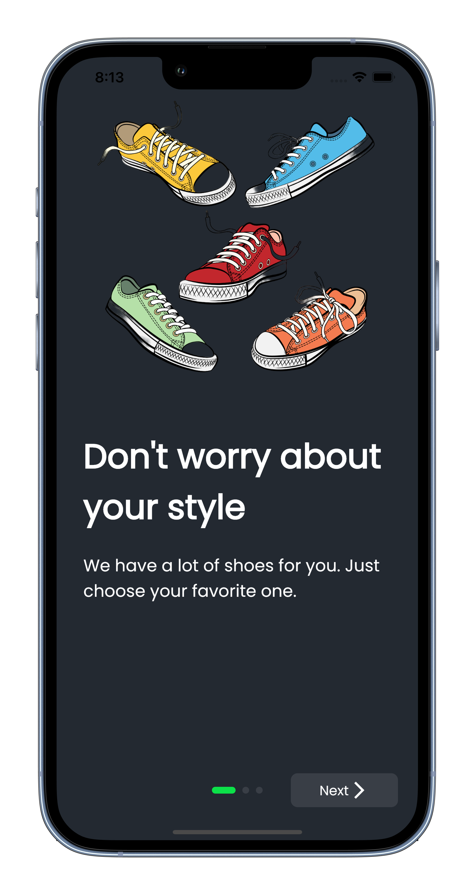

# FOOTESH STORE
A simple desain for shoes store. 
I want implement some feature like this:
1. User interface: The user interface is crucial to the success of your shoe application. It should be easy to navigate, visually appealing, and functional. Consider using high-quality images, animations, and interactive elements to make the app engaging and user-friendly.

2. Product catalog: Your shoe application should have a robust catalog of shoes that users can browse and search through. Consider including filtering options to allow users to sort shoes by size, color, style, and other attributes. You may also want to include product descriptions, reviews, and pricing information.

3. Shopping cart and checkout: To allow users to purchase shoes, you'll need to include a shopping cart and checkout process. Make sure the shopping cart is easy to access and update, and the checkout process is streamlined and secure.

4. User accounts: Including user accounts can provide several benefits, such as allowing users to save their favorite shoes, view their purchase history, and track their orders. You may also want to include social login options to make it easy for users to create an account.

5. Push notifications: Push notifications can be an effective way to keep users engaged with your shoe application. You can send notifications about sales, new products, or order updates to keep users informed and encourage them to return to the app.

6. Analytics: To understand how users are interacting with your shoe application, you may want to include analytics tools. This can provide insights into user behavior, which can help you make informed decisions about app improvements and marketing strategies.

7. Integration with payment gateways: Integrating with payment gateways like PayPal or Stripe will allow users to easily and securely make payments within the app.

*This project not finished yet.

  
  

